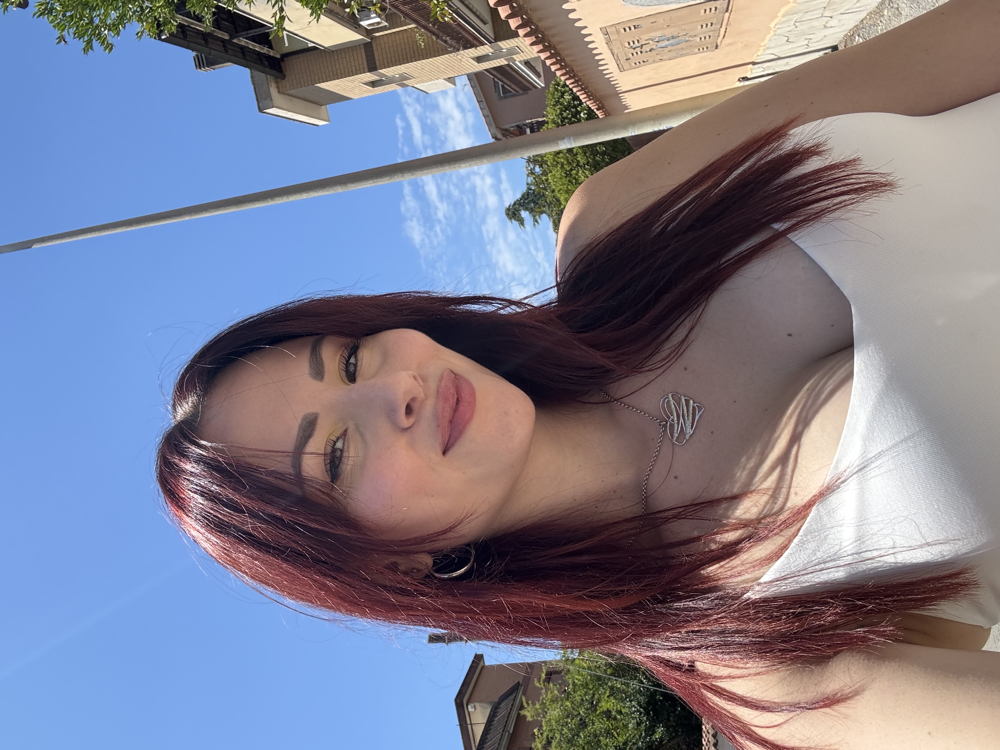

<!DOCTYPE html>
<html lang="it">
<head>
<meta charset="UTF-8">
<meta name="viewport" content="width=device-width, initial-scale=1.0">
<title>Mary De Lillo</title>
<link href="https://fonts.googleapis.com/css2?family=Montserrat:wght@400;700&display=swap" rel="stylesheet">

</head>
<body>

<!-- Splash screen -->

Ciao, benvenuto!

<!-- Pagina principale -->

<h1>Mary De Lillo</h1>

Tutti i miei link ufficiali

<a class="button" href="https://www.instagram.com/mary.delillo?igsh=NGg4MW9vMzZyanRt&utm_source=qr" target="_blank">Instagram</a>
<a class="button" href="https://www.tiktok.com/@marydelilloofficial?_r=1&_t=ZN-91fms8Tr71K" target="_blank">TikTok</a>
<a class="button" href="https://onlyfans.com/marydelillo" target="_blank">Contenuti esclusivi</a>
<a class="button" href="https://t.me/MaryDeLilloVirgo" target="_blank">Telegram</a>

</body>
</html>
